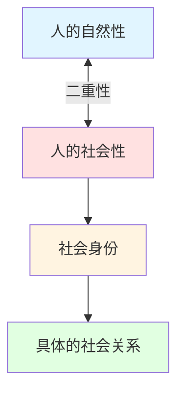

<div align="center">

# 社会意识形式跟进计划

### Social Ideology Tracking Project (SITP)

[](LICENSE)
[]()
[]()
[]()

> 一本面向 Z 世代青年的社会学著作——探讨人的自然性与社会性、社会身份的生成与维度，以及具体社会关系中的身份实践。

[📖 阅读进度](#-写作进度) • [🗺️ 项目大纲](#️-全书大纲) • [💡 核心理念](#-核心立意) • [⚖️ 版权声明](#️-版权声明)

</div>

---

## 💡 核心立意

### 主线逻辑



#### 🔑 三个核心命题

1. **人的二重性**  
   人既是自然的生物个体，也是社会的关系存在。这两者之间的张力，构成了我们理解一切社会现象的出发点。

2. **社会身份**  
   身份不是天生的，而是在社会互动中被赋予、被建构、被争夺的。我们从社会身份入手，剖析"我是谁"这个问题的社会性答案。

3. **下沉到具体关系**  
   抽象的身份理论必须落地。家庭中的角色、朋友圈中的位置、职场中的层级、网络社群中的认同——这些具体的社会关系，才是身份真正发生作用的场所。

---

## 🎯 目标读者

<table>
<tr>
<td width="50%">

### 📌 核心读者群

**Z 世代青年（约 18–38 岁）**

- 🔍 正在建立自我认同的关键阶段
- ⚡ 面对多重社会身份的冲突与困惑
- 🌐 在网络与现实之间切换身份
- 💭 对既有社会叙事保持怀疑，渴望新的解释框架

</td>
<td width="50%">

### ✍️ 写作风格

**深度但不晦涩**  
严谨但有温度  
批判但不教条

用社会学的解剖刀，  
切开日常生活的表象，  
让你看到结构的骨架。

</td>
</tr>
</table>

---

## 📚 写作进度

<div align="center">

### 整体完成度


**已完成：2 / 8+ 卷** | **最后更新：2025-09-20**

</div>

### ✅ 已完成卷册

| 卷 | 标题 | 字数 | 状态 |
|:---:|:---|:---:|:---:|
| **第一卷** | [人的二重性——自然性与社会性](book/第一卷%20人的二重性.md) | ~8,500字 | ✅ 完成 |
| **第三卷** | [社会关系——亲子关系](book/第三卷%20社会关系——亲子关系.md) | ~28,000字 | ✅ 完成 |

### 🚧 进行中

| 卷 | 标题 | 状态 |
|:---:|:---|:---:|
| **第四卷** | 社会关系——恋爱关系 | 🎯 框架搭建中 |

---

## 🗺️ 全书大纲

<details open>
<summary><b>📖 第一卷：人的二重性——自然性与社会性</b> ✅</summary>

- 被割裂的人
- 作为生物的人
- 作为社会的人
- 二元之间的张力

</details>

<details>
<summary><b>🎭 第二卷：社会身份的生成与维度</b></summary>

**身份的生成**
- 什么是社会身份
- 身份的来源
- 身份认同的建构
- 多重身份与身份冲突

**身份的维度**
- 阶级身份
- 族群与民族身份
- 性别身份
- 代际身份
- 其他重要维度

</details>

<details open>
<summary><b>👨‍👩‍👧 第三卷：社会关系——亲子关系</b> ✅</summary>

- 亲子关系的二重性
- 一个屋檐，两个世界
- 代际冲突的结构性根源
- 养育的债务逻辑
- Z世代的代际困境

</details>

<details open>
<summary><b>💕 第四卷：社会关系——恋爱关系</b> 🚧</summary>

- 欲望的自然性与社会性
- 择偶中的隐形结构
- 恋爱关系中的身份建构
- 从恋爱到婚姻：制度化的路径
- Z世代的恋爱困境与新可能

</details>

<details>
<summary><b>🤝 第五卷：社会关系——友谊关系</b></summary>

（待规划）

</details>

<details>
<summary><b>💼 第六卷：社会关系——职场关系</b></summary>

（待规划）

</details>

<details>
<summary><b>🌐 第七卷：社会关系——网络社群关系</b></summary>

（待规划）

</details>

<details>
<summary><b>🏛️ 第八卷：社会关系——公共空间关系</b></summary>

（待规划）

</details>

<details>
<summary><b>🌊 终卷：Z 世代的身份困境与出路</b></summary>

- 流动的现代性与身份的不确定性
- 数字化生存与身份分裂
- 意义的危机
- 重建联结

</details>

> 📄 完整大纲详见：[outlines/v1-outline.md](outlines/v1-outline.md)

---

## 🗂️ 项目结构

```
social-ideology-tracking-project/
│
├── 📖 book/                    # 正文卷册
│   ├── 第一卷 人的二重性.md
│   ├── 第二卷 社会身份.md
│   ├── 第三卷 社会关系——亲子关系.md
│   ├── 第四卷 社会关系——恋爱关系.md
│   └── 附录-关键概念释义.md
│
├── 📝 notes/                   # 研究笔记与素材
│   ├── 阅读笔记/
│   ├── 案例素材/
│   └── 概念草稿/
│
├── 🗺️ outlines/                # 各版本大纲
│   └── v1-outline.md
│
├── 📚 references/              # 参考文献
│   └── bibliography.md
│
├── 📄 README.md               # 项目介绍（你在这里）
├── ⚖️ LICENSE                 # 版权声明
└── .gitignore
```

---

## 🔄 版本管理

本项目使用 **Git** 进行版本管理，确保：

- ✅ 可以随时回溯到任意历史版本
- ✅ 重大结构调整在分支上进行，确认后再合并
- ✅ 每个版本的大纲独立存档于 `outlines/` 目录
- ✅ 每一章的撰写、每一次修改都通过 commit 记录

---

## 🔗 关键概念

<table>
<tr>
<td width="50%">

### 🧬 基础理论

- **自然性与社会性**
- **感官的牢笼**
- **利己与利他**
- **二重性**
- **社会工具论**

</td>
<td width="50%">

### 🎭 身份与关系

- **血缘父母 vs 社会父母**
- **符号暴力**（布迪厄）
- **社会意识形式**
- **照护赤字**
- **1-2-4 家庭结构**

</td>
</tr>
</table>

> 💡 完整概念释义详见：[book/附录-关键概念释义.md](book/附录-关键概念释义.md)

---

## ⚖️ 版权声明

<div align="center">

**Copyright © 2026. All Rights Reserved.**

</div>

本仓库中的全部内容（包括但不限于文字、大纲、概念框架）均为作者原创，保留所有权利。

- ❌ **未经作者明确书面许可**，任何人不得复制、分发、传播、展示、修改或以任何形式利用本作品的任何部分
- ❌ **禁止将本作品用于任何商业目的**
- 📚 **作者保留未来以任何形式**（包括但不限于纸质书籍、电子书、有声书等）出版本作品的全部权利

> ℹ️ 本仓库在 GitHub 上公开可见仅出于版本管理和学术交流之目的，不构成对任何权利的授权或让渡。

---

## 📬 关于作者

<div align="center">

一个试图理解这个时代的观察者和写作者。

---

**SITP — 社会意识形式跟进计划**

*让隐形的结构变得可见*

[](https://github.com/JimMinseay3/social-ideology-tracking-project)

</div>
